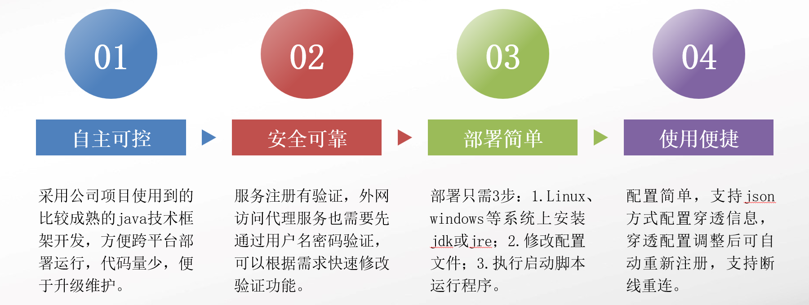
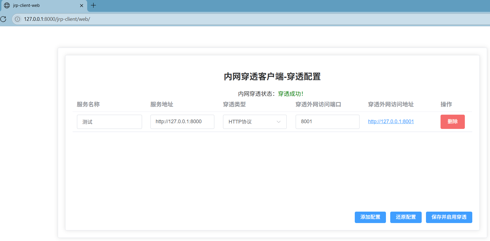

# jrp-nat(Java Remote Proxy Network Address Translation)

## introductions

A cross-platform intranet penetration tool developed by Spring Boot and Vert.x, implemented via service relay, supporting HTTP/HTTPS (WebSocket, SSE), TCP (SSH, database connections, Windows remote), and UDP.

Supported features of this tool:
1. HTTP, HTTPS, TCP, and UDP tunneling, **both HTTP and HTTPS can be tunneled as HTTPS**.
2. Unified authentication via username and password for "HTTP, HTTPS, TCP, UDP", with default username and password set on the server side, **clients can customize username and password**.
3. Reconnection functionality and SSL enablement.
4. Hot reloading of client tunneling configurations via web page, with configurations stored in files or Redis.
5. Server-side persistence of client tunneling registration information to disk configuration files.
6. IPv4 and IPv6 tunneling.

Unsupported proxy features:
1. STCP: Secure TCP intranet proxy that does not require exposing ports on the server side.
2. SUDP: Secure UDP intranet proxy, similar to STCP, does not require exposing ports on the server side.
3. XTCP: Point-to-point intranet tunneling proxy, similar to STCP, but traffic does not need to go through the server relay.
4. TCPMUX: TCP port multiplexing on the server side, allowing access to different intranet services through the same port.
5. STATIC: Static file intranet proxy, supports static file access through the tunnel.

jrp-nat includes server component `jrp-server` and client component `jrp-client`.

First, deploy `jrp-server` on a server with a fixed public IP and open ports, then deploy the client `jrp-client` within the intranet. The client supports configuration management via web page or configuration file (configuration file modifications will automatically re-register without restarting the client).

## features



1. **Cross-platform and easy maintenance**: Runs on Java, requiring only JDK or JRE 1.8+ installed. Developed using Vert.x with minimal code for easy maintenance.
2. **Secure and reliable**: Service registration includes verification, and external access to proxy services requires username/password authentication first. Authentication features can be quickly modified as needed.
3. **Simple deployment**: Deployment requires only 3 steps: 1. Install JDK or JRE on Linux, Windows, etc.; 2. Modify configuration files; 3. Execute startup scripts to run the program.
4. **Convenient usage**: Simple configuration, clients support JSON file or web interface configuration for tunneling information. After adjusting tunneling configurations, clients don't need to restart as they'll automatically re-register. Supports reconnection with configurable retry counts.

## architecture

1. Software architecture description:

   Spring Boot 2.7.14 (runtime control, configuration management) + Vert.x 4.5.3 (service management, service proxy, service relay) + Vue3 (web management interface implemented with Element UI)
2. Function implementation diagram:
   

## instructions

1. Install JDK 8+ or JRE 8+. JRE download address: https://www.oracle.com/java/technologies/javase/javase8u211-later-archive-downloads.html.

2. Download the packaged files "jrp-server-1.0.3.tar.gz, jrp-client-1.0.3.tar.gz", place them on the corresponding machines and extract. Download address: https://gitee.com/java-tony/jrp-nat-vertx/releases/tag/v1.0.3.

3. Modify parameters under `vertx.jrp` in the configuration file `application.yml`:
   a. jrp-server configuration for intranet penetration relay service (server with dedicated public IP and ports):
   ```
   vertx:
     jrp:
       # Web management page port for intranet penetration relay service
       page-port: 10086
       # Web management page access path for intranet penetration relay service
       page-path: /jrp-server
       # Intranet service registration port
       register-port: 2000
       ssl: false
       # Certificate file path, if not configured will use auto-generated self-signed certificate
       cert-path:
       # Key file path, if not configured will use auto-generated self-signed key
       key-path:
       # Username for web management page and HTTP authentication access
       username: admin
       # Password for web management page and HTTP authentication access
       password: 10010
       # HTTP Digest authentication algorithm
       algorithm: MD5
       # Intranet penetration service registration verification information, client must match server
       token: 2023202
   ```

   b. jrp-client configuration for intranet penetration client service (LAN machine that can access the server with public IP and ports):
    ```
    vertx:
      jrp:
        # Configuration storage type
        config-store-type: file
        # Registration address for intranet penetration proxy service, server's public IP and port (vertx.jrp.register-port),supported ipv6(eg:"[2408:8266:e01:7e04:119c:9be2:2bba:4178]:2000")
        register-address: "127.0.0.1:2000"
        # Whether to enable SSL for penetration relay websocket
        ssl: false
        # Reconnection attempts for intranet penetration proxy service registration
        reconnection-times: 600
        # Intranet penetration verification information, must match jrp-server configuration
        token: 2023202
        # Authentication username after successful penetration, if not configured uses server's authentication info
        username: client
        # Authentication password after successful penetration, if not configured uses server's authentication info
        password: 10086
        redis:
          # Standalone-STANDALONE, Sentinel-SENTINEL, Cluster-CLUSTER, Replication-REPLICATION
          client-type: STANDALONE
          # URL address, if configured takes priority, format: redis://[:password@]host:port[/database]
          url: redis://127.0.0.1:6379
          # Database number, configured when URL not set or in cluster mode, defaults to 0
          database: 0
          # Address, configured when URL not set or in cluster mode, defaults to localhost
          host: 127.0.0.1
          # Port, configured when URL not set or in cluster mode, defaults to 6379
          port: 6379
          # Password, configured when URL not set or in cluster mode, defaults to empty
          password:
          # Configured in cluster mode, defaults to empty
          nodes:
            - 127.0.0.1:6379
    ```

4. Start the intranet penetration server (on server with public IP and ports) via [start.bat](jrp-server/src/bin/start.bat) on Windows or [start.sh](jrp-server/src/bin/start.sh) on Linux.
5. Modify intranet penetration client proxy configuration parameters in config.json. Currently supports HTTP (WebSocket), TCP (PostgreSQL, MySQL and other database services, Windows remote), UDP:
   ```
    {
     "path": "jrp-client",// HTTP access path for proxy service configuration management
     "port": 8000,// HTTP access port for proxy service configuration management
      "remote_proxies": [// Intranet penetration configuration: registering intranet services to external relay proxy service
       {
         "type": "HTTP",// Penetration type
         "remote_port": 8001,// Penetration port, the service port after proxy by external relay service
         "proxy_pass": "http://127.0.0.1:8000"// Intranet service address
       },
       {
         "type": "TCP",
         "remote_port": 2022,// Penetration port, the service port after proxy by external relay service
         "proxy_pass": "127.0.0.1:22"
       }
      ]
    }
   ```

6. Start the client: Launch the intranet penetration client service via `java -Dfile.encoding=utf-8 -Dspring.config.location=./application.yml -jar jrp-client-1.0.3.jar` (typically on an intranet server with internet access).
7. After successful startup, modify penetration configurations via the page at http://127.0.0.1:8000/jrp-client/web/, as shown below:
   
8. After successful proxy penetration (HTTP, TCP, or UDP), access the external IP port via browser HTTP and enter the authentication information (default admin,10010 for server or client,10086 if set) configured on the server. After server restart, re-authentication is required.
9. Windows auto-start configuration:

   Method 1: Place the start.bat script in the folder "C:\ProgramData\Microsoft\Windows\Start Menu\Programs\StartUp", example:
   [start.bat](jrp-client/src/bin/start.bat)
   ```
   chcp 65001
   cd D:\jrp-client
   D:
   java -server -Dfile.encoding=utf-8 -Dspring.config.location=./application.yml -jar jrp-client-1.0.3.jar
   ```

   Method 2: https://gitee.com/mirrors_kohsuke/winsw
10. Linux auto-start configuration for server:
    a. Place jar package and configuration files in /home/jrp-server directory.
    b. Create file /etc/systemd/system/jrp-server.service with the following content:
       ```
       [Unit]
       Description=JRP Server Service
       After=network.target
       
       [Service]
       Type=simple
       User=root
       WorkingDirectory=/home/jrp-server
       ExecStart=/usr/bin/java -Dfile.encoding=utf-8 -Dspring.config.location=./application.yml -jar jrp-server-1.0.3.jar
       Restart=on-failure
       RestartSec=10
       
       [Install]
       WantedBy=multi-user.target
       ```

    c. After creating the service file, execute the following commands to enable the service and set auto-start:
       ```
       sudo systemctl daemon-reload
       sudo systemctl enable jrp-server.service
       sudo systemctl start jrp-server.service
       ```

    d. Verify service status: sudo systemctl status jrp-server.service
11. Linux auto-start configuration for client:

a. Place jar package and configuration files in /home/jrp-client directory.

b. Create file /etc/systemd/system/jrp-client.service with the following content:
```
[Unit]
Description=JRP Client Service
After=network.target

[Service]
Type=simple
User=root
WorkingDirectory=/home/jrp-client
ExecStart=/usr/bin/java -Dfile.encoding=utf-8 -Dspring.config.location=./application.yml -jar jrp-client-1.0.3.jar
Restart=on-failure
RestartSec=10

[Install]
WantedBy=multi-user.target
```

c. After creating the service file, execute the following commands to enable the service and set auto-start:
```
sudo systemctl daemon-reload
sudo systemctl enable jrp-client.service
sudo systemctl start jrp-client.service
```

d. Verify service status: sudo systemctl status jrp-client.service

## release notes

### 1.0.1
2025-06-10:
1. Fixed issues with large file uploads causing disconnections and insufficient memory by controlling WebSocket reconnection via idletimeout and controlling upload speed when buffer is full.
2. Removed unused dependency packages, optimized code structure, and extracted timeout parameters as constants.

2025-07-28:
1. Fixed port occupation prompt after reconnection.
2. Added web configuration interface for clients, equivalent to direct configuration file modification.

### 1.0.2
1. Clients can now customize authentication information (username, password) after successful penetration (optional configuration, if not configured, unified authentication using server-side configuration).
2. Server adds functionality to persist client penetration registration information to disk configuration files.
3. Clients can now store configuration information in Redis.
4. Added UDP penetration functionality and HTTPS penetration to HTTP functionality.
5. Code structure optimization.
6. Improved readme.md file and added Linux service configuration instructions.

### 1.0.3
1. Added functionality to penetrate HTTPS or HTTP services as self-signed HTTPS services.
2. Added IPv6 support, registration address in client's application.yml can be configured as server's IPv6 address.
3. Added SSL configuration for WebSocket connections between client and server, requiring both client and server's application.yml files to configure ssl value as true.