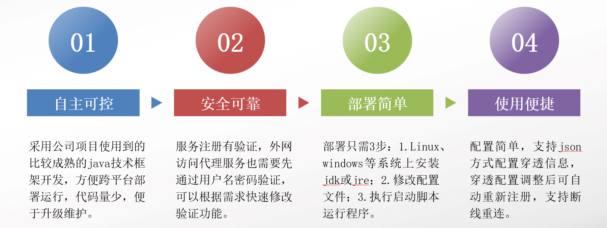
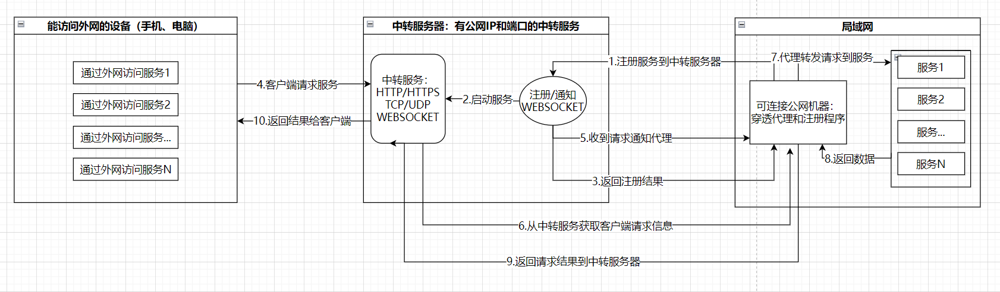
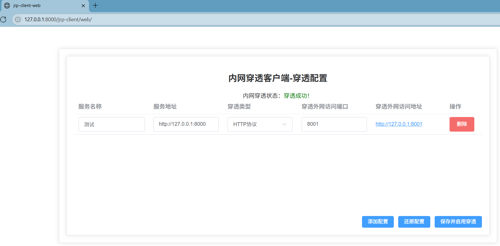

# jrp-nat内网穿透工具(Java Reverse Proxy Network Address Translation)

## 内网穿透工具介绍

基于spring boot、vert.x开发的跨平台的内网穿透工具，服务中转方式实现，支持HTTP（Websocket、SSE）、TCP(
ssh、数据库连接、windows远程)、UDP穿透。

jrp-nat包括服务端jrp-server和客户端jrp-client。

先在有固定公网IP和开放对应端口的服务器上部署穿透服务端jrp-server，然后在内网部署服务穿透客户端jrp-client，客户端支持通过web配置页面或者配置文件管理配置（配置文件修改后会自动重新注册，不需要重启客户端）。

## 工具特点



1. **跨平台好维护**： 都通过java启动，装有jdk或jre 1.8+就可以运行，使用vert.x开发，代码量少好维护。
2. **安全可靠**： 服务注册有验证，外网访问代理服务也需要先通过用户名密码验证，可以根据需求快速修改验证功能。
3. **部署简单**： 部署只需3步：1.Linux、windows等系统上安装jdk或jre；2.修改配置文件；3.执行启动脚本运行程序。
4. **使用便捷**： 配置简单，客户端支持json文件方式或者客户端web界面配置穿透信息，穿透配置调整后，不需要重启客户端，会自动重新注册，支持断线重连，可通过参数配置重连次数。

## 软件架构

1. 软件架构说明：

   Spring Boot 2.7.14（运行控制、配置管理）+Vert.x 4.5.3（服务管理、服务代理、服务中转）+vue3(element ui实现web端管理配置信息)
2. 功能实现图解：
   

## 安装教程

1. 安装jdk8+或jre8+，jre下载地址：https://www.oracle.com/java/technologies/javase/javase8u211-later-archive-downloads.html。

2. 下载已打好的包“jrp-server-1.0.2.tar.gz、jrp-client-1.0.2.tar.gz”，放到对应机器上，并解压，下载地址：https://gitee.com/java-tony/jrp-nat-vertx/releases/tag/v1.0.2。

3. 修改配置文件application.yml里vertx.jrp下参数：     
   a. 内网穿透中转服务jrp-server配置（带独立外网ip和端口的服务器）：
   ```
   vertx:
     jrp:
       #内网服务注册端口
       register-port: 2000
       #内网穿透中转服务web管理页面端口
       page-port: 10086
       #内网穿透中转服务web管理页面访问路径
       page-path: /jrp-server
       #内网穿透中转服务web管理页面登录用户名、穿透服务http认证访问用户名
       username: admin
       #内网穿透中转服务web管理页面密码、穿透服务http认证访问密码
       password: 10010
       #http Digest认证算法
       algorithm: MD5
       #内网穿透服务注册验证信息，客户端需要和服务端一样，不然不能注册。
       token: 2023202
   ```  
   b. 内网穿透客户端服务jrp-client配置（没有外网ip，能联网访问到带外网ip和端口服务器的局域网机器）:
    ```
    vertx:
      jrp:
        #配置文件存储方式
        config-store-type: file
        #内网穿透代理服务注册地址，服务端外网ip和端口(vertx.jrp.register-port)
        register-address: 127.0.0.1:2000
        #内网穿透代理服务注册断线重连次数
        reconnection-times: 600
        #内网穿透验证信息和jrp-server配置值一样，不然不能注册。
        token: 2023202
        #穿透成功后，访问时的认证用户名，如果没配置会使用服务端里面配置的认证信息。
        username: client
        #穿透成功后，访问时的认证密码，如果没配置会使用服务端里面配置的认证信息。
        password: 10086
        redis:
          # 单机-STANDALONE,哨兵-SENTINEL,集群-CLUSTER,主从-REPLICATION
          client-type: STANDALONE
          # url地址，默认空，如果配置了会优先使用，格式：redis://[:password@]host:port[/database]
          url: redis://127.0.0.1:6379
          # 数据库编号 url没设置时或者集群模式时配置，不配置时默认0
          database: 0
          #  地址 url没设置时或者集群模式时配置，不配置时默认localhost
          host: 127.0.0.1
          # 端口 url没设置时或者集群模式时配置，不配置时默认6379
          port: 6379
          # 密码 url没设置时或者集群模式时配置，默认空
          password:
          # 集群模式时配置，不配时，默认空
          nodes:
            - 127.0.0.1:6379
    ```
4. window通过[start.bat](jrp-server/src/bin/start.bat)，linux通过[start.sh](jrp-server/src/bin/start.sh)
   启动内网穿透服务端（有外网ip和端口的服务器上启动）。
5. 修改内网穿透客户端穿透代理配置参数config.json,目前支持HTTP(websocket)、TCP(pg、mysql等数据库服务，windows远程)、UDP:
   ```
    {
     "path": "jrp-client",//代理服务配置管理服务HTTP访问路径
     "port": 8000,//代理服务配置管理服务HTTP访问端口
      "remote_proxies": [//内网穿透配置：内网服务注册到外网中转代理服务上实现内网穿透
       {
         "type": "HTTP",//穿透类型
         "remote_port": 8001,//穿透端口，外网中转代理服务代理后的服务端口
         "proxy_pass": "http://127.0.0.1:8000"//内网服务地址
       },
       {
         "type": "TCP",
         "remote_port": 2022,//穿透端口，外网中转代理服务代理后的服务端口
         "proxy_pass": "127.0.0.1:22"
       }
      ]
    }
   ```
6. 启动客户端：通过java -Dfile.encoding=utf-8 -Dspring.config.location=./application.yml -jar jrp-client-1.0.2.jar启动内网穿透客户端服务（一般是一台能联网的内网服务器）。
7. 启动成功后，可以通过页面 http://127.0.0.1:8000/jrp-client/web/ 可修改穿透配置，页面如下：
   
8. 穿透代理成功后，不管是http、tcp还是udp代理成功后，得先通过浏览器HTTP方式访问外网ip端口，输入服务端配置的用户名密码认证信息( 默认为admin,10010)，服务端重启后会要求重新输入认证信息。
9. windows开机启动配置：

   方式1：打开文件夹“C:\ProgramData\Microsoft\Windows\Start Menu\Programs\StartUp”，start.bat脚本放到里面，示例如下：
   [start.bat](jrp-client/src/bin/start.bat)
   ```
   chcp 65001
   cd D:\jrp-client
   D:
   java -server -Dfile.encoding=utf-8 -Dspring.config.location=./application.yml -jar jrp-client-1.0.2.jar
   ```
   方式二：https://gitee.com/mirrors_kohsuke/winsw
10. 服务端linux开机启动配置：
   1.jar包和配置文件放到/home/jrp-server目录下。
   2.创建文件 /etc/systemd/system/jrp-server.service，内容如下：
   ```
   [Unit]
   Description=JRP Server Service
   After=network.target
   
   [Service]
   Type=simple
   User=root
   WorkingDirectory=/home/jrp-server
   ExecStart=/usr/bin/java -Dfile.encoding=utf-8 -Dspring.config.location=./application.yml -jar jrp-server-1.0.2.jar
   Restart=on-failure
   RestartSec=10
   
   [Install]
   WantedBy=multi-user.target
   ```
   3.创建完服务文件后，执行以下命令使服务生效并设置开机启动：
   ```
   sudo systemctl daemon-reload
   sudo systemctl enable jrp-server.service
   sudo systemctl start jrp-server.service
   ```
   4.验证服务状态：sudo systemctl status jrp-server.service
11. 客户端linux开机启动配置： 
   1.jar包和配置文件放到/home/jrp-client目录下。

   2.创建文件 /etc/systemd/system/jrp-client.service，内容如下：
   ```
   [Unit]
   Description=JRP Client Service
   After=network.target
   
   [Service]
   Type=simple
   User=root
   WorkingDirectory=/home/jrp-client
   ExecStart=/usr/bin/java -Dfile.encoding=utf-8 -Dspring.config.location=./application.yml -jar jrp-client-1.0.2.jar
   Restart=on-failure
   RestartSec=10
   
   [Install]
   WantedBy=multi-user.target
   ```
   3.创建完服务文件后，执行以下命令使服务生效并设置开机启动：
   ```
   sudo systemctl daemon-reload
   sudo systemctl enable jrp-client.service
   sudo systemctl start jrp-client.service
   ```
   4.验证服务状态：sudo systemctl status jrp-client.service
## 版本修订记录
### 1.0.1版本
2025-06-10：
   1. 修复大文件上传容易导致断开和内存不够用问题，通过idletimeout控制websocket断线重连，通过写满控制上传速度。
   2. 去掉没用到的依赖包，优化代码结构，超时时间等参数提取成常量。

2025-07-28：
   1. 修改重连后提示端口占用问题。
   2. 客户端增加web配置界面，和直接改配置文件等效。
### 1.0.2版本
1. 客户端增加自定义穿透成功后访问认证信息（用户名、密码，可选配置，未配置时统一使用服务端配置的认证信息进行认证）功能。
2. 服务端添加持久化客户端穿透注册信息到磁盘功能。
3. 客户端增加配置信息存储到redis功能。
4. 增加UDP穿透功能。
5. 代码结构优化。
6. 完善readme.md文件，增加linux添加服务配置说明。