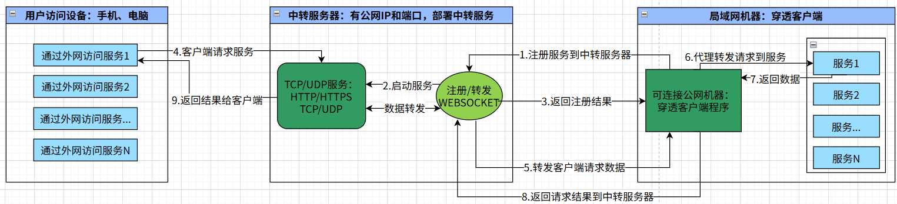
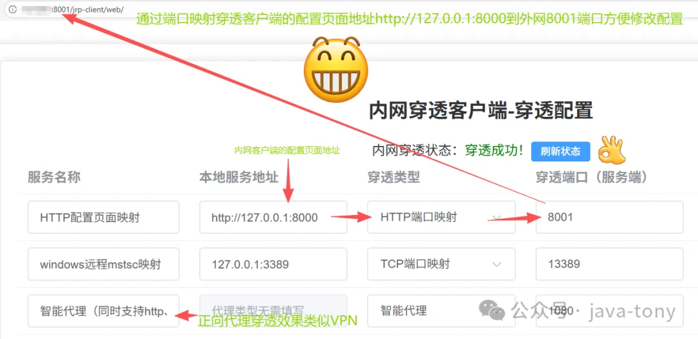

# jrp内网穿透工具(Java Remote Proxy Network Address Translation)

## jrp介绍

基于spring boot、vert.x开发的跨平台的内网穿透工具，服务中转方式实现。

支持功能清单：
1. 端口映射穿透：HTTP、HTTPS、TCP、UDP
2. 正向代理穿透：HTTP代理、HTTPS代理、STCP(sock4/SOCKS5 TCP)，**HTTP、HTTPS都可以穿透为HTTPS**。
3. 统一认证：**所有穿透服务都需要通过http/https用户名和密码认证**，服务端设置默认用户名、密码，**客户端可自定义用户名、密码**。
4. 稳定安全：断线重连功能、开启ssl功能。
5. 热加载：客户端穿透配置热加载，通过web页面修改配置，配置可存文件或redis。
6. 注册留痕：服务端持久化客户端穿透注册信息到磁盘配置文件。
7. IPV4、IPV6穿透。

## jrp特点
1. **跨平台好维护**： 都通过java启动，装有jdk或jre 1.8+就可以运行，使用vert.x开发，代码量少好维护。
2. **安全可靠**： 服务注册有验证，外网访问代理服务也需要先通过用户名密码验证，可以根据需求快速修改验证功能。
3. **部署简单**： 部署只需3步：1.Linux、windows等系统上安装jdk或jre；2.修改配置文件；3.执行启动脚本运行程序。
4. **使用便捷**： 配置简单，客户端支持json文件方式或者客户端web界面配置穿透信息，穿透配置调整后，不需要重启客户端，会自动重新注册，支持断线重连，可通过参数配置重连次数。

## 软件架构

1. 软件架构说明：

   Spring Boot 2.7.14（运行控制、配置管理）+Vert.x 4.5.3（服务管理、服务代理、服务中转）+vue3(element ui实现web端管理配置信息)
2. 功能实现图解：
   

## 快速开始
1. [JRP内网穿透快速上手](quick-start.md)
2. [JRP内网穿透快速上手（java-tony）](https://mp.weixin.qq.com/s/q0oIVFbKBJ3zHC8P4UKMcw)
3. 微信扫码阅读、收藏：


## 详细教程

1. 安装jdk8+或jre8+，下载地址：
   * 国内linux-x64：https://repo.huaweicloud.com/java/jdk/8u202-b08/jdk-8u202-linux-x64.rpm 下载后通过“rpm -ivh jdk-8u202-linux-x64.rpm”命令安装。
   * 国内windows-x64：https://repo.huaweicloud.com/java/jdk/8u202-b08/jdk-8u202-windows-x64.exe 
   * 官网（需登录）：https://www.oracle.com/java/technologies/javase/javase8u211-later-archive-downloads.html
2. jrp下载地址：https://gitee.com/java-tony/jrp-nat-vertx/raw/develop/deploy/jrp.zip
   下载后解压jrp.zip：
    * client文件夹下为客户端，放在家里或公司电脑上；
    * server文件夹下为服务端，需要放到有独立外网IP的服务器（比如云服务器）。
3. 修改配置文件application.yml里vertx.jrp下参数：     
   a.内网穿透中转服务jrp-server配置文件：
   ```
   vertx:
     jrp:
       #内网穿透中转服务web管理页面端口
       page-port: 10086
       #内网穿透中转服务web管理页面访问路径
       page-path: /jrp-server
       #内网服务注册访问端口，服务端和客户端转发通信的websocket端口
       register-port: 2000
       ssl: false
       #证书文件路径，如果未配置会使用自动生成的自签名证书文件
       cert-path:
       #密钥文件路径，如果未配置会使用自动生成的自签名密匙文件
       key-path:
       #内网穿透中转服务web管理页面登录用户名、穿透服务http认证访问用户名
       username: admin
       #内网穿透中转服务web管理页面密码、穿透服务http认证访问密码
       password: 10010
       #http Digest认证算法
       algorithm: MD5
       #内网穿透服务注册验证信息，客户端需要和服务端一样，不然不能注册。
       token: 2023202
   ```  
   b.内网穿透内网客户端client配置文件:
    ```
    vertx:
      jrp:
        #默认file，配置文件存储方式
        config-store-type: file
        #必须修改，内网穿透代理注册服务地址，服务端启动时，会自动注册到内网穿透代理服务中，支持ipv6地址(比如:"[2408:8266:e01:7e04:119c:9be2:2bba:4178]:2000")
        register-address: 127.0.0.1:2000
        #默认false，穿透中转websocket是否启用ssl
        ssl: false
        #默认，内网穿透代理服务注册断线重连次数
        reconnection-times: 600
        #默认，内网穿透验证信息和jrp-server配置值一样，不然不能注册。
        token: 2023202
        #默认，穿透成功后，访问时的认证用户名，如果没配置会使用服务端里面配置的认证信息。
        username: client
        #默认，穿透成功后，访问时的认证密码，如果没配置会使用服务端里面配置的认证信息。
        password: 10086
        #config-store-type为redis时才需要配置redis
        redis:
          # 单机-STANDALONE,哨兵-SENTINEL,集群-CLUSTER,主从-REPLICATION
          client-type: STANDALONE
          # url地址，默认空，如果配置了会优先使用，格式：redis://[:password@]host:port[/database]
          url: redis://127.0.0.1:6379
          # 数据库编号 url没设置时或者集群模式时配置，不配置时默认0
          database: 0
          #  地址 url没设置时或者集群模式时配置，不配置时默认localhost
          host: 127.0.0.1
          # 端口 url没设置时或者集群模式时配置，不配置时默认6379
          port: 6379
          # 密码 url没设置时或者集群模式时配置，默认空
          password:
          # 集群模式时配置，不配时，默认空
          nodes:
            - 127.0.0.1:6379
    ```
4. window通过[start.bat](jrp-server/src/bin/start.bat)，linux通过[start.sh](jrp-server/src/bin/start.sh)
   启动内网穿透服务端（有外网ip和端口的服务器上启动）。
5. 修改内网穿透客户端穿透代理配置参数config.json:
   ```
    {
     "path": "jrp-client",//代理服务配置管理服务HTTP访问路径
     "port": 8000,//代理服务配置管理服务HTTP访问端口
      "remote_proxies": [//内网穿透配置：内网服务注册到外网中转代理服务上实现内网穿透
       {
         "type": "HTTP",//穿透类型
         "remote_port": 8001,//穿透端口，外网中转代理服务代理后的服务端口
         "proxy_pass": "http://127.0.0.1:8000"//内网服务地址
       },
       {
         "type": "TCP",
         "remote_port": 2022,//穿透端口，外网中转代理服务代理后的服务端口
         "proxy_pass": "127.0.0.1:22"
       }
      ]
    }
   ```
   **type说明：**
   * **端口转发穿透可配置值：** HTTP、HTTPS(websocket)、TCP(pg、mysql等数据库服务，windows远程)、UDP。
   * **正向代理穿透可配置值：** HTTP_PROXY,HTTPS_PROXY,SOCKS4,SOCKS5、SMART_PROXY。
6. 启动客户端：通过java -Dfile.encoding=utf-8 -Dspring.config.location=./application.yml -jar jrp-client-1.0.3.jar启动内网穿透客户端服务（一般是一台能联网的内网服务器）。
7. 启动成功后，可以通过页面 http://127.0.0.1:8000/jrp-client/web/ 可修改穿透配置，页面如下（也参考步骤5可通过jrp代理到外网http://外网IP:8001/jrp-client/web/）：
   
8. 穿透代理成功后，不管是http、tcp还是udp代理成功后，得先通过浏览器HTTP方式访问外网ip端口，输入服务端配置的用户名密码认证信息( 默认为admin,10010)或者客户端设置的认证信息（默认为client,10086），服务端重启后会要求重新输入认证信息。
9. windows开机启动配置：
    * 方式一：打开文件夹“C:\ProgramData\Microsoft\Windows\Start Menu\Programs\StartUp”，start.bat脚本放到里面，示例如下：
      [start.bat](jrp-client/src/bin/start.bat)
      ```
      chcp 65001
      cd D:\jrp-client
      D:
      java -server -Dfile.encoding=utf-8 -Dspring.config.location=./application.yml -jar jrp-client-1.0.3.jar
      ```
    * 方式二：https://gitee.com/mirrors_kohsuke/winsw
10. 服务端linux开机启动配置：
    * a.jar包和配置文件放到/home/jrp-server目录下。
    * b.创建文件 /etc/systemd/system/jrp-server.service，内容如下：
       ```
       [Unit]
       Description=JRP Server Service
       After=network.target
       
       [Service]
       Type=simple
       User=root
       WorkingDirectory=/home/jrp-server
       ExecStart=/usr/bin/java -Dfile.encoding=utf-8 -Dspring.config.location=./application.yml -jar jrp-server-1.0.3.jar
       Restart=on-failure
       RestartSec=10
       
       [Install]
       WantedBy=multi-user.target
       ```
    * c.创建完服务文件后，执行以下命令使服务生效并设置开机启动：
       ```
       sudo systemctl daemon-reload
       sudo systemctl enable jrp-server.service
       sudo systemctl start jrp-server.service
       ```
    * d.验证服务状态：sudo systemctl status jrp-server.service
11. 客户端linux开机启动配置： 
    * a.jar包和配置文件放到/home/jrp-client目录下。
    * b.创建文件 /etc/systemd/system/jrp-client.service，内容如下：
   ```
   [Unit]
   Description=JRP Client Service
   After=network.target
   
   [Service]
   Type=simple
   User=root
   WorkingDirectory=/home/jrp-client
   ExecStart=/usr/bin/java -Dfile.encoding=utf-8 -Dspring.config.location=./application.yml -jar jrp-client-1.0.3.jar
   Restart=on-failure
   RestartSec=10
   
   [Install]
   WantedBy=multi-user.target
   ```
   * c.创建完服务文件后，执行以下命令使服务生效并设置开机启动：
   ```
   sudo systemctl daemon-reload
   sudo systemctl enable jrp-client.service
   sudo systemctl start jrp-client.service
   ```
   * d.验证服务状态：sudo systemctl status jrp-client.service
## 版本修订记录
### 1.0.1版本
* 2025-06-10：
   1. 修复大文件上传容易导致断开和内存不够用问题，通过idletimeout控制websocket断线重连，通过写满控制上传速度。
   2. 去掉没用到的依赖包，优化代码结构，超时时间等参数提取成常量。
* 2025-07-28：
   1. 修改重连后提示端口占用问题。
   2. 客户端增加web配置界面，和直接改配置文件等效。
### 1.0.2版本
1. 客户端增加自定义穿透成功后访问认证信息（用户名、密码，可选配置，未配置时统一使用服务端配置的认证信息进行认证）功能。
2. 服务端添加持久化客户端穿透注册信息到磁盘配置文件功能。
3. 客户端增加配置信息存储到redis功能。
4. 增加UDP穿透功能，增加https穿透为http功能。
5. 代码结构优化。
6. 完善readme.md文件，增加linux添加服务配置说明。
### 1.0.3版本
1. 增加HTTPS或者HTTP服务穿透为自签名HTTPS服务功能。
2. 增加IPV6支持，客户端application.yml里注册地址可以配置为服务端的IPV6地址。
3. 客户端和服务端websocket连接增加开启ssl配置功能，需要客户端和服务端的application.yml文件里都配置ssl的值为true。
### 1.1.0 版本
1. 认证加固：安全考虑，去掉HTTP类认证通过后基于IP的简单认证，认证通过去掉返回认证类型提示，只返回200状态码；验证增加时间限制控制，时间限制参数可在配置文件配置。
2. HTTP(S)代理穿透：增加HTTP正向代理、HTTPS正向代理穿透功能，结合window等代理配置正向代理方式（输入内网服务地址和端口号）穿透访问内网。
3. SOCKS代理穿透：增加SOCK4正向代理、SOCK5正向代理穿透功能，结合window等代理配置正向代理方式（输入内网服务地址和端口号）穿透访问内网。
4. 开机自启动：在安装了jdk或jre基础上，在linux和window环境下通过脚本或者程序一键设置开机自启。
### 1.2.0 版本
1. 穿透端口自动分配：客户端可配置为动态获取外网穿透端口，注册时服务端动态分配一个可用端口并返回给客户端。
2. 传用户的源IP到内网：http请求增加X_REAL_IP参数。
3. 同一端口访问不同内网服务：支持TCP端口的多路复用，允许通过同一端口访问不同的内网服务。即每个http穿透可配置路由规则，按规则路由到不同服务。
4. 穿透服务启用停用控制：每个穿透代理都可单独启用和停用，默认启用。
5. P2P内网穿透：点对点内网穿透，client支持在用户端以用户端模式启动，服务端增加协助打洞功能，打洞成功后，流量不再经过服务器中转。
   p2p打洞功能使用流程：
   1. 客户端穿透配置启用p2p打洞，与服务端建立连接。
   2. 服务端初始化打洞服务，穿透端口同时用于打洞和服务器中转访问。
   3. 用户电脑上以用户模式启动客户端，配置打洞端口和本地访问端口，与服务端建立连接。
   4. 客户端与服务端建立连接成功后，服务端协助打洞，成功后走创建好的隧道直连访问内网服务。
   5. 没成功打洞，走服务器中转访问。
## 联系我
如需了解更多，请关注微信公众号java-tony：

https://mp.weixin.qq.com/mp/appmsgalbum?__biz=MzI5MTIyODk3NQ==&action=getalbum&album_id=4202910982592675855#wechat_redirect