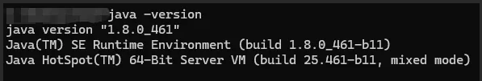
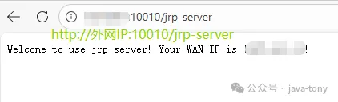
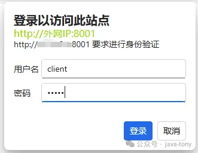
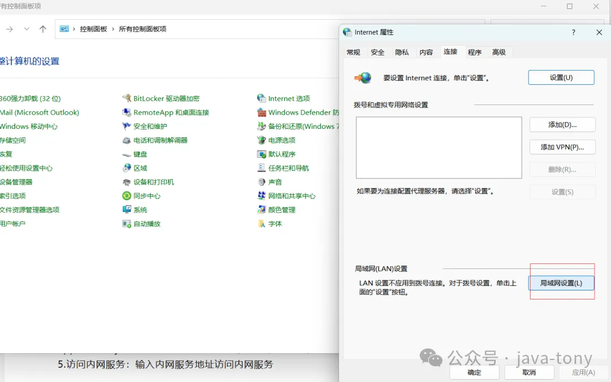
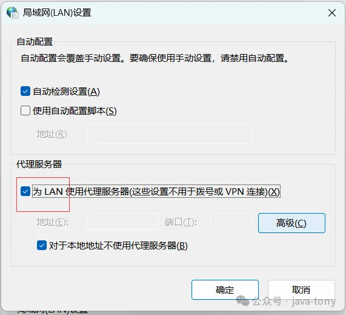
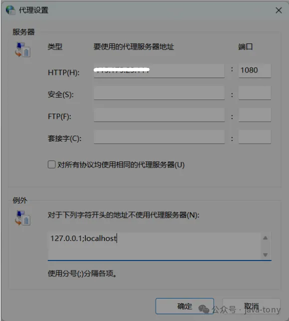
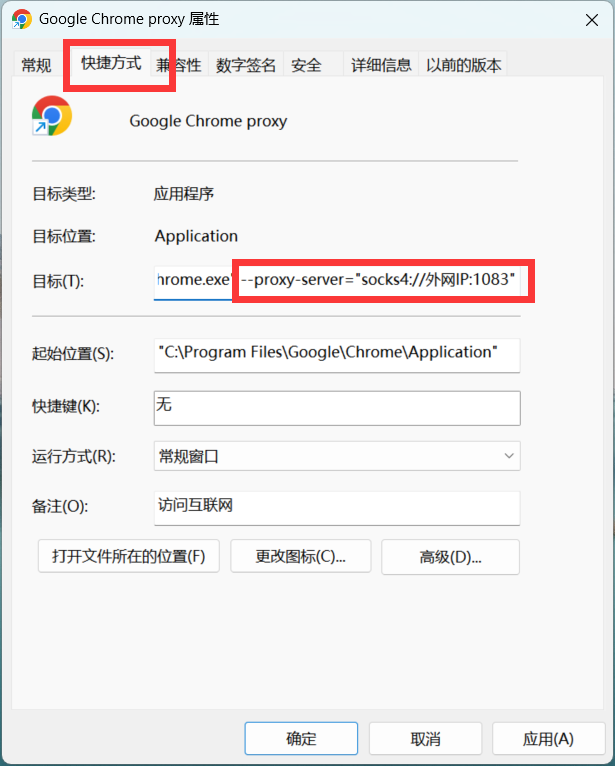

# jrp内网穿透快速上手
jrp-nat-vertx支持“HTTP、HTTPS、TCP、UDP”端口映射穿透和“HTTP代理、HTTPS代理、STCP(sock4/SOCKS5 TCP)”正向代理穿透。
## 一、下载解压
1. 下载地址：
https://gitee.com/java-tony/jrp-nat-vertx/raw/develop/deploy/jrp.zip
2. 下载后解压jrp.zip：
   * client文件夹下为客户端，放在家里或公司电脑上；
   * server文件夹下为服务端，需要放到有独立外网IP的服务器（比如云服务器）。
## 二、部署
### 服务端部署（外网服务器）
1. **防火墙开放端口：** 10010(验证启动)、2000(注册)、8001(客户端外网配置页面)、1080(正向代理穿透端口)，其他端口按需开放。
2. **安装Java：** JDK8或JRE8，有的linux服务器自带可不再安装，可执行java -version检查是否安装，如果输出java version开头的信息，代表已有java运行环境，如下图所示：
    
3. **启动服务：**
   - Windows：双击 start.bat 
   - Linux：chmod u+x start.sh 后（首次启动给权限），执行 ./start.sh
4. **验证启动：** 访问http://外网IP:10010/jrp-server可获取访问端公网出口IP。
   
### 客户端部署（内网机器）
1. **修改配置：** application.yml中register-address值里的IP改为服务端IP
2. **安装Java：** JDK8或JRE8
3. **启动客户端：** 同样通过 start.bat 或 start.sh
4. **管理界面：** 客户端电脑访问 http://127.0.0.1:8000/jrp-client/web/ 配置穿透(也可修改config.json文件，无需重启)，也可通过服务端代理后的地址http://外网IP:8001/jrp-client/web/访问，首次访问需要输入用户名client和密码10086完成认证。
   * 如果是代理后的“http://外网IP:端口”访问，首次访问浏览器会弹出输入http认证信息框如下：
   
   * 客户端穿透配置页面如下：
    
## 三、两种使用方式
### 方式一：基于端口穿透（简单直接）
- **适用类型：** HTTP、HTTPS、TCP、UDP。
- **访问方式：** 通过映射的外网IP:端口访问内网服务。
- **首次需认证：** 默认用户名client，默认密码10086。
### 方式二：正向代理穿透（一网打尽）
- **适用类型：** 
  - HTTP(S)代理：HTTP_PROXY、HTTPS_PROXY。
  - socks代理：SOCKS4、SOCKS5。
  - 智能代理：SMART_PROXY，自动匹配HTTP_PROXY,HTTPS_PROXY,SOCKS4,SOCKS5。
- **设置步骤：**
1. 电脑配置代理：IP设为外网IP，端口1080。
2. 首次访问需要先通过浏览器访问http://外网IP:1080输入用户名client密码10086完成认证，认证通过返回ok。
3. 直接输入内网地址访问所有服务。
## 四、正向代理穿透用户电脑配置
用户使用时支持多种方式配置，比如借助第三方用户端代理软件、通过windows自带代理配置、通过浏览器配置代理。
下面介绍windows代理配置和Chrome浏览器配置：
### 1、win11配置（推荐）
在“开始->控制面版->网络和 Internet->Internet选项->连接->局域网设置”里做精细化配置，比如配置只通过穿透代理访问内网http服务可按如下截图所示配置：

**需要注意**：因为基于安全考虑，给socks、https正向代理都加了http认证，如果自定义配置 **“安全(S)”或“套接字”** 时，**“列外”** 里需要填上外网IP，才能通过"http://代理服务器外网IP:外网端口比如1080"进行http认证，认证通过后才能代理穿透访问内网服务，比如**配置列外为**：**127.0.0.1;外网服务器IP**。
### 2、Google Chrome浏览器配置
1. **找到chrome.exe浏览器的路径：** 比如C:\Program Files\Google\Chrome\Application\chrome.exe。
2. **创建chrome代理快捷方式：** 右键chrome.exe，选择"发送到"->"桌面快捷方式", 然后到桌面选择快捷方式右键->属性->目标地址后面填写代理地址：
   **"C:\Program Files\Google\Chrome\Application\chrome.exe" --proxy-server="http://WANIP:1080"** 并双击快捷方式运行。

    
3. **首次访问：** 访问 http://WANIP:1080 认证，输入穿透客户端用户名client和密码10086进行认证（application.yml里配置的用户名密码，可以按需修改）。
4. **访问内网服务：** 输入内网服务地址访问内网服务。

## 总结
jrp是非常适合个人搭建使用的穿透工具，支持穿透类型多，部署和配置简单、免费开源跨平台，尤其适合软件开发人员（比如java开发人员可几分钟内完成部署和使用）使用或学习研究。六部完成搭建和使用，外网服务器部署服务端->服务器开放端口->内网部署客户端->通过页面配置穿透服务->如果是正向代理类型穿透需用户端配置代理->即可通过外网IP或者内网IP访问内网服务。